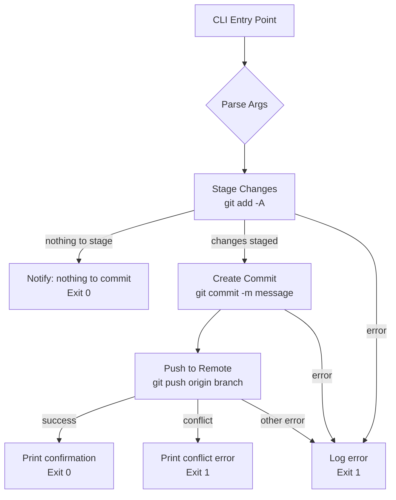

# Design Document

## Feature: github-push-changes

---

## Overview

This feature implements a CLI script that automates the full Git push workflow: staging all local changes, creating a commit, and pushing to the configured GitHub remote. It targets developers in this monorepo who need a reliable, repeatable way to publish work without manually running multiple Git commands.

The implementation is a Node.js/TypeScript script (consistent with the existing backend tooling) that wraps the local Git CLI via `child_process`. It is invoked from the command line and supports optional flags (`--message`, `--remote`, `--force`, `--dry-run`).

---

## Architecture

The script follows a linear pipeline of three stages, each of which can fail independently. A shared logger writes structured status lines to stdout/stderr throughout.



**Dry-run mode** intercepts each stage before execution, logs what would happen, and returns without touching the working tree or remote.

---

## Components and Interfaces

### `GitClient`

Thin wrapper around `child_process.execSync` / `spawnSync`. Responsible for executing Git commands and surfacing stdout/stderr.

```typescript
interface GitClient {
  /** Run a git command; throws GitError on non-zero exit */
  exec(args: string[]): string;
  /** Returns the current branch name */
  currentBranch(): string;
  /** Returns true when the working tree has no changes */
  isClean(): boolean;
}
```

### `StageStep`

```typescript
interface StageResult {
  skipped: boolean; // true when working tree is clean
  stagedFiles: string[];
}

function stageChanges(client: GitClient, dryRun: boolean): StageResult;
```

### `CommitStep`

```typescript
interface CommitResult {
  skipped: boolean; // true when staging area was empty
  sha: string;
  message: string;
}

function createCommit(
  client: GitClient,
  message: string,
  dryRun: boolean
): CommitResult;
```

### `PushStep`

```typescript
interface PushResult {
  branch: string;
  remote: string;
  commitsCount: number;
}

function pushCommits(
  client: GitClient,
  remote: string,
  force: boolean,
  dryRun: boolean
): PushResult;
```

### `Logger`

```typescript
interface Logger {
  stepStart(step: string): void;
  stepDone(step: string, detail?: string): void;
  stepSkip(step: string, reason: string): void;
  error(step: string, message: string): void;
}
```

### `CLI Entry Point`

Parses `process.argv`, wires the three steps together, and maps results to exit codes.

```typescript
interface PushOptions {
  message?: string;   // defaults to "chore: push all changes"
  remote?: string;    // defaults to "origin"
  force?: boolean;    // defaults to false
  dryRun?: boolean;   // defaults to false
}
```

---

## Data Models

### `GitError`

```typescript
class GitError extends Error {
  constructor(
    public readonly command: string,
    public readonly exitCode: number,
    public readonly stderr: string
  ) {
    super(`git ${command} failed (exit ${exitCode}): ${stderr}`);
  }
}
```

### `ConflictError`

```typescript
class ConflictError extends GitError {
  /** Human-readable instruction for the developer */
  readonly resolution: string =
    'Pull and merge (or rebase) the remote changes before retrying: git pull --rebase origin <branch>';
}
```

### `OperationSummary`

```typescript
interface OperationSummary {
  staged: string[];       // list of staged file paths
  commitSha: string;      // short SHA of the new commit
  commitMessage: string;
  branch: string;
  remote: string;
  commitsCount: number;
  dryRun: boolean;
}
```

---

## Correctness Properties

*A property is a characteristic or behavior that should hold true across all valid executions of a system — essentially, a formal statement about what the system should do. Properties serve as the bridge between human-readable specifications and machine-verifiable correctness guarantees.*

### Property 1: All working-tree files are staged

*For any* set of file paths present in the working tree (tracked, untracked, modified, deleted), after calling `stageChanges`, every file in that set should appear in the staged file list returned by the function.

**Validates: Requirements 1.1**

---

### Property 2: Gitignore patterns exclude files from staging

*For any* file path and any gitignore glob pattern that matches that path, the file should not appear in the staged file list after `stageChanges` completes.

**Validates: Requirements 1.2**

---

### Property 3: Commit contains all staged changes

*For any* non-empty set of staged file changes, the commit created by `createCommit` should reference exactly those files — no more, no fewer.

**Validates: Requirements 2.1**

---

### Property 4: Commit author metadata round-trip

*For any* author name and email string pair configured in the Git environment, the commit produced by `createCommit` should have `author.name` and `author.email` equal to the configured values.

**Validates: Requirements 2.2**

---

### Property 5: User-supplied commit message is preserved

*For any* non-empty commit message string supplied by the user, the commit produced by `createCommit` should have a message field equal to that exact string.

**Validates: Requirements 2.3**

---

### Property 6: Push targets the correct remote and branch

*For any* remote name and branch name, when `pushCommits` is called with that remote, the underlying git push command should target exactly that remote and branch combination.

**Validates: Requirements 3.1, 3.2**

---

### Property 7: Success confirmation contains branch and commit count

*For any* branch name and positive integer commit count, the confirmation message produced after a successful push should contain both the branch name and the commit count as substrings.

**Validates: Requirements 3.3**

---

### Property 8: Conflict detection aborts push with instructions

*For any* diverged remote state (remote has commits not present locally), calling `pushCommits` should throw a `ConflictError` whose message contains pull/merge/rebase instructions, and the push should not be executed.

**Validates: Requirements 4.1, 4.2**

---

### Property 9: Force-push only when explicitly requested

*For any* push configuration that does not include `force: true`, the git push command constructed by `pushCommits` should not contain the `--force` flag. Conversely, when `force: true` is set, the command should include `--force`.

**Validates: Requirements 4.3**

---

### Property 10: Every step produces a log entry

*For any* valid set of push operation inputs, the log output produced during the operation should contain at least one entry for each of the three steps (stage, commit, push), each including the step name and a status indicator.

**Validates: Requirements 5.1**

---

### Property 11: Failures produce non-zero exit and log the error

*For any* Git error message injected as a step failure, the process should exit with a non-zero status code and the log output should contain the injected error message.

**Validates: Requirements 5.2**

---

### Property 12: Dry-run leaves working tree and remote unchanged

*For any* working tree state, running the push operation with `dryRun: true` should leave the working tree and the remote repository in exactly the same state as before the operation, while still producing a report describing what would have been staged, committed, and pushed.

**Validates: Requirements 5.4**

---

## Error Handling

| Scenario | Behaviour |
|---|---|
| Working tree is clean | Log "nothing to commit", exit 0 |
| Staging fails (permissions, locked index) | Log `GitError.stderr`, exit 1 |
| Commit fails (no author config) | Log `GitError.stderr`, exit 1 |
| Push rejected (conflict) | Throw `ConflictError`, log resolution hint, exit 1 |
| Push fails (network, auth) | Log `GitError.stderr`, exit 1 |
| `--force` without explicit flag | Never force-push; log error if remote rejects |
| `--dry-run` | Simulate all steps, log what would happen, exit 0 |

All errors are caught at the top-level entry point. The script never swallows errors silently — every failure path writes to stderr and exits with a non-zero code.

---

## Testing Strategy

### Unit Tests (example-based)

- Default commit message is `"chore: push all changes"` when none is supplied (Requirement 2.4)
- Empty staging area skips commit creation (Requirement 2.5)
- Successful full run exits with code 0 (Requirement 5.3)
- Authentication relies on credential store — no credentials are embedded in the command (Requirement 3.4)

### Property-Based Tests

The project uses **[fast-check](https://github.com/dubzzz/fast-check)** (already installed as a dev dependency in `apps/backend`). Each property test runs a minimum of **100 iterations**.

Each test is tagged with a comment in the format:
```
// Feature: github-push-changes, Property N: <property text>
```

Properties 1–12 above each map to a single `fc.assert(fc.property(...))` call. The `GitClient` is mocked so tests run in-memory without touching the file system or network.

**Key arbitraries needed:**

```typescript
// Random file paths
const filePathArbitrary = fc.array(
  fc.stringOf(fc.constantFrom(...'abcdefghijklmnopqrstuvwxyz0123456789_-'.split('')), { minLength: 1, maxLength: 20 }),
  { minLength: 1, maxLength: 10 }
).map(parts => parts.join('/') + '.ts');

// Random branch names
const branchNameArbitrary = fc.stringOf(
  fc.constantFrom(...'abcdefghijklmnopqrstuvwxyz0123456789-_/'.split('')),
  { minLength: 1, maxLength: 40 }
);

// Random remote names
const remoteNameArbitrary = fc.constantFrom('origin', 'upstream', 'fork', 'backup');

// Random commit messages
const commitMessageArbitrary = fc.string({ minLength: 1, maxLength: 200 });

// Random author config
const authorArbitrary = fc.record({
  name: fc.string({ minLength: 1, maxLength: 50 }),
  email: fc.emailAddress(),
});
```

### Integration Tests

- End-to-end test using a temporary bare Git repository (created with `git init --bare`) to verify the full stage → commit → push pipeline against a real local remote.
- Conflict scenario: push to a remote that has been advanced, verify `ConflictError` is thrown.
