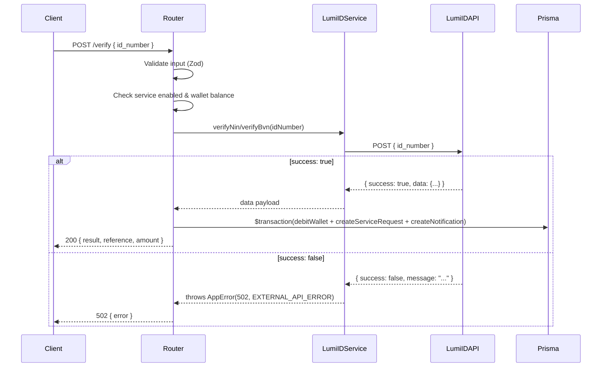

# Design Document: LumiID API Integration

## Overview

This feature replaces the existing VerifyMe integration for NIN verification with the LumiID API, and introduces a new live BVN verification flow that currently relies on manual admin handling via `ServiceRequestForm`.

The core change is a new shared `lumiid.service.ts` that encapsulates all HTTP communication with LumiID. Both the NIN router (refactored) and a new BVN router consume this service. The `Internal_Result` shape is preserved exactly, so wallet debiting, `ServiceRequest` storage, notifications, and admin views require no structural changes. The frontend BVN verification page is upgraded from a passive form submission to a live API-driven flow with immediate result display.

### Key Design Decisions

- **Shared service module over inline HTTP calls**: Following the `flutterwave.service.ts` pattern, all LumiID HTTP logic lives in one place. This avoids duplicating auth headers, base URLs, and error normalisation across two routers.
- **Preserve `Internal_Result` shape**: LumiID field names differ from VerifyMe (`birthdate` vs `dob`, no `middlename`). The mapping layer in each router normalises these differences so no downstream consumer changes are needed.
- **Fail-fast env validation**: `LUMIID_API_KEY` is added as a required field in the Zod env schema. The app will not start if it is missing.
- **No debit on API failure**: The wallet debit and `ServiceRequest` creation happen inside a Prisma transaction that is only entered after a successful LumiID response, preserving the existing guard pattern.

---

## Architecture

```mermaid
graph TD
    subgraph Frontend
        BVNPage["BVN Verification Page\n/dashboard/bvn/verification"]
    end

    subgraph Backend
        NINRouter["NIN Router\nPOST /api/v1/nin/verify"]
        BVNRouter["BVN Router\nPOST /api/v1/bvn/verify"]
        LumiIDService["lumiid.service.ts\nverifyNin() / verifyBvn()"]
        EnvConfig["env.ts\nLUMIID_API_KEY"]
        WalletService["wallet.service.ts\ndebitWallet()"]
        PrismaDB["Prisma / PostgreSQL\nServiceRequest, Wallet"]
    end

    subgraph External
        LumiIDAPI["LumiID API\napi.lumiid.com"]
    end

    BVNPage -->|POST /bvn/verify| BVNRouter
    NINRouter --> LumiIDService
    BVNRouter --> LumiIDService
    LumiIDService -->|reads key| EnvConfig
    LumiIDService -->|HTTP POST| LumiIDAPI
    NINRouter --> WalletService
    BVNRouter --> WalletService
    NINRouter --> PrismaDB
    BVNRouter --> PrismaDB
```



### Request Flow (NIN & BVN)



---

## Components and Interfaces

### 1. `lumiid.service.ts` (new)

Location: `apps/backend/src/services/lumiid.service.ts`

```typescript
// LumiID NIN response data shape
interface LumiIDNinData {
  firstname?: string;
  lastname?: string;
  birthdate?: string;
  photo?: string | null;
  residence?: { state?: string };
}

// LumiID BVN response data shape
interface LumiIDBvnData {
  firstname?: string;
  lastname?: string;
  birthdate?: string;
  phone?: string;
}

export async function verifyNin(idNumber: string): Promise<LumiIDNinData>
export async function verifyBvn(idNumber: string): Promise<LumiIDBvnData>
```

Both functions:
- Read `LUMIID_API_KEY` from `getEnv()`
- POST to the respective LumiID endpoint with `{ id_number: idNumber }`
- Return `response.data.data` on `success: true`
- Throw `AppError(502, EXTERNAL_API_ERROR, response.data.message)` on `success: false`
- Throw `AppError(502, EXTERNAL_API_ERROR, ...)` on network/timeout errors

### 2. `env.ts` (modified)

Add `LUMIID_API_KEY` as a required field; remove `VERIFYME_API_KEY`:

```typescript
LUMIID_API_KEY: z.string().min(1, 'LUMIID_API_KEY is required'),
```

### 3. `nin.router.ts` (modified)

- Remove `VERIFYME_BASE`, `verifyMeHeaders()`, and `callNimcApi()` 
- Import and call `verifyNin` from `lumiid.service.ts`
- Map LumiID response to `Internal_Result`:

```typescript
const result = {
  fullName:   `${data.firstname || ''} ${data.lastname || ''}`.trim(),
  firstName:  data.firstname  || '',
  lastName:   data.lastname   || '',
  middleName: '',
  dob:        data.birthdate  || '',
  gender:     '',
  phone:      '',
  photo:      data.photo      ?? null,
  nin:        body.nin        || '',
};
```

### 4. `bvn.router.ts` (new)

Location: `apps/backend/src/routes/bvn.router.ts`

Exposes `POST /bvn/verify` with the same guard pattern as `nin.router.ts`:
1. Zod validation: `bvn` must match `/^\d{11}$/`
2. Service lookup by slug `bvn-verification`
3. Wallet balance check
4. Call `verifyBvn(body.bvn)`
5. Map to `Internal_Result`:

```typescript
const result = {
  fullName:   `${data.firstname || ''} ${data.lastname || ''}`.trim(),
  firstName:  data.firstname  || '',
  lastName:   data.lastname   || '',
  middleName: '',
  dob:        data.birthdate  || '',
  gender:     '',
  phone:      data.phone      || '',
  photo:      null,
  bvn:        body.bvn,
};
```

6. Prisma `$transaction`: `debitWallet` + `createServiceRequest` (status `COMPLETED`) + `createNotification`
7. Return `{ result, reference, amount }`

Register in `index.ts`:
```typescript
import bvnRouter from './routes/bvn.router';
app.use('/api/v1/bvn', bvnRouter);
```

### 5. BVN Verification Page (modified)

Location: `apps/frontend/app/dashboard/bvn/verification/page.tsx`

Replace `ServiceRequestForm` with a client component `BvnVerificationForm` that:
- Has a controlled input for the 11-digit BVN
- Validates client-side before calling the API
- Calls `POST /api/v1/bvn/verify` via `fetch`
- Shows loading state (spinner + disabled button) during the request
- On success: renders a result card with `firstName`, `lastName`, `dob`
- On error: displays the API error message
- On `INSUFFICIENT_BALANCE` error: shows a specific message with a link to `/dashboard/wallet`

---

## Data Models

No new Prisma models are required. The existing `ServiceRequest` model stores BVN results in the same `adminResponse` JSON field used by NIN:

```
ServiceRequest {
  userId       String
  serviceId    String          // references Service with slug "bvn-verification"
  reference    String          // UUID
  status       "COMPLETED"
  formData     Json            // { bvn: "..." }
  adminResponse Json           // { result: InternalResult, respondedAt: ISO string }
  amount       Decimal
}
```

### Internal_Result Shape

Both NIN and BVN verifications produce this normalised shape:

```typescript
interface InternalResult {
  fullName:   string;       // "firstname lastname"
  firstName:  string;       // from LumiID firstname
  lastName:   string;       // from LumiID lastname
  middleName: string;       // always "" (LumiID NIN basic has no middlename)
  dob:        string;       // from LumiID birthdate
  gender:     string;       // always "" (not in LumiID basic endpoints)
  phone:      string;       // from LumiID BVN phone; "" for NIN
  photo:      string | null;// from LumiID NIN photo; null for BVN
  nin?:       string;       // submitted NIN (NIN flow only)
  bvn?:       string;       // submitted BVN (BVN flow only)
}
```

All absent or null LumiID fields are substituted with `""` (strings) or `null` (photo), ensuring no `undefined` values reach storage or the frontend.

---

## Correctness Properties

*A property is a characteristic or behavior that should hold true across all valid executions of a system — essentially, a formal statement about what the system should do. Properties serve as the bridge between human-readable specifications and machine-verifiable correctness guarantees.*

### Property 1: Success response passthrough

*For any* LumiID API response where `success` is `true`, `verifyNin` and `verifyBvn` SHALL return the `data` payload unchanged to the caller.

**Validates: Requirements 1.3**

### Property 2: Error message propagation

*For any* LumiID API error response where `success` is `false`, the thrown `AppError` SHALL carry the exact `message` string from the LumiID response, HTTP status 502, and error code `EXTERNAL_API_ERROR`.

**Validates: Requirements 1.4**

### Property 3: NIN response mapping completeness

*For any* LumiID NIN response data object (with any combination of fields present or absent), the NIN router mapping SHALL produce an `Internal_Result` where every field is defined, no field contains `undefined`, string fields default to `""`, and `photo` defaults to `null`.

**Validates: Requirements 3.2, 6.1, 6.2**

### Property 4: BVN response mapping completeness

*For any* LumiID BVN response data object (with any combination of fields present or absent), the BVN router mapping SHALL produce an `Internal_Result` where every field is defined, no field contains `undefined`, string fields default to `""`, and `photo` is always `null`.

**Validates: Requirements 4.8, 6.1, 6.2**

### Property 5: Wallet never debited on API failure

*For any* `AppError` thrown by `verifyNin` or `verifyBvn`, the wallet debit operation SHALL never be called — the user's balance SHALL remain unchanged.

**Validates: Requirements 3.4, 4.10**

### Property 6: Invalid NIN inputs are always rejected

*For any* string that does not match exactly 11 numeric digits, a POST to `/nin/verify` SHALL return a 422 response with error code `VALIDATION_ERROR` and SHALL NOT call `verifyNin` or debit the wallet.

**Validates: Requirements 3.5**

### Property 7: Invalid BVN inputs are always rejected

*For any* string that does not match exactly 11 numeric digits, a POST to `/bvn/verify` SHALL return a 422 response with error code `VALIDATION_ERROR` and SHALL NOT call `verifyBvn` or debit the wallet.

**Validates: Requirements 4.2, 4.3**

### Property 8: Insufficient balance guard

*For any* wallet balance and service price where balance < price, a POST to `/bvn/verify` SHALL return an `INSUFFICIENT_BALANCE` error and SHALL NOT call `verifyBvn`.

**Validates: Requirements 4.6**

### Property 9: Frontend validation rejects invalid BVN before API call

*For any* BVN input string that does not match 11 numeric digits, the BVN verification page SHALL display a validation error and SHALL NOT make an API call.

**Validates: Requirements 5.2**

### Property 10: Frontend displays all identity fields from API response

*For any* successful API response containing `firstName`, `lastName`, and `dob`, the BVN verification page SHALL render all three values visibly in the result display.

**Validates: Requirements 5.4**

### Property 11: Frontend displays API error messages

*For any* error response from the API, the BVN verification page SHALL display the error message string returned by the API.

**Validates: Requirements 5.5**

---

## Error Handling

| Scenario | HTTP Status | Error Code | Wallet Debited? |
|---|---|---|---|
| LumiID returns `success: false` | 502 | `EXTERNAL_API_ERROR` | No |
| LumiID network timeout / unreachable | 502 | `EXTERNAL_API_ERROR` | No |
| Invalid NIN/BVN format | 422 | `VALIDATION_ERROR` | No |
| Service not found | 404 | `SERVICE_NOT_FOUND` | No |
| Service disabled | 400 | `SERVICE_DISABLED` | No |
| Insufficient wallet balance | 400 | `INSUFFICIENT_BALANCE` | No |
| Missing `LUMIID_API_KEY` at startup | App crash | — | N/A |

All errors flow through the existing `errorHandler` middleware. The `AppError` factory methods (`AppError.externalApiError`, `AppError.validationError`, etc.) are used consistently.

**Network error normalisation** in `lumiid.service.ts`:

```typescript
try {
  const response = await axios.post(url, body, { headers });
  if (!response.data.success) {
    throw AppError.externalApiError(response.data.message || 'LumiID verification failed');
  }
  return response.data.data;
} catch (err) {
  if (err instanceof AppError) throw err;
  throw AppError.externalApiError('LumiID API is unreachable. Please try again.');
}
```

---

## Testing Strategy

### Unit Tests (example-based)

- `lumiid.service.test.ts`: Mock axios; verify correct URL, body, and headers for both `verifyNin` and `verifyBvn`; verify network error handling
- `nin.router.test.ts`: Mock `lumiid.service`; verify routing, service lookup, wallet guard, and `ServiceRequest` creation
- `bvn.router.test.ts`: Mock `lumiid.service`; verify routing, service lookup, wallet guard, and `ServiceRequest` creation
- `BvnVerificationForm.test.tsx`: Render tests for loading state, success display, error display, and insufficient balance message

### Property-Based Tests (fast-check, minimum 100 iterations each)

The project uses `fast-check` (already installed). Tests live in `apps/backend/src/__tests__/unit/`.

**`lumiid.service.pbt.test.ts`**

- **Property 1** — `Feature: lumid-api-integration, Property 1: Success response passthrough`
  Generate random `data` objects; mock axios to return `{ success: true, data }`. Assert returned value deep-equals `data`.

- **Property 2** — `Feature: lumid-api-integration, Property 2: Error message propagation`
  Generate random error message strings; mock axios to return `{ success: false, message }`. Assert thrown `AppError` has `statusCode === 502`, `code === EXTERNAL_API_ERROR`, and `message` matches.

**`nin.router.pbt.test.ts`**

- **Property 3** — `Feature: lumid-api-integration, Property 3: NIN response mapping completeness`
  Generate random partial LumiID NIN data objects (using `fc.record` with optional fields). Apply the mapping. Assert no `undefined` values, correct defaults.

- **Property 5 (NIN)** — `Feature: lumid-api-integration, Property 5: Wallet never debited on API failure`
  Generate random `AppError` instances; mock `verifyNin` to throw. Assert `debitWallet` is never called.

- **Property 6** — `Feature: lumid-api-integration, Property 6: Invalid NIN inputs are always rejected`
  Use `invalidNinArbitrary` from `pbt.helpers.ts`. POST to `/nin/verify`. Assert 422 and `verifyNin` not called.

**`bvn.router.pbt.test.ts`**

- **Property 4** — `Feature: lumid-api-integration, Property 4: BVN response mapping completeness`
  Generate random partial LumiID BVN data objects. Apply the mapping. Assert no `undefined` values, `photo === null`.

- **Property 5 (BVN)** — `Feature: lumid-api-integration, Property 5: Wallet never debited on API failure`
  Generate random `AppError` instances; mock `verifyBvn` to throw. Assert `debitWallet` is never called.

- **Property 7** — `Feature: lumid-api-integration, Property 7: Invalid BVN inputs are always rejected`
  Use `invalidBvnArbitrary` from `pbt.helpers.ts`. POST to `/bvn/verify`. Assert 422 and `verifyBvn` not called.

- **Property 8** — `Feature: lumid-api-integration, Property 8: Insufficient balance guard`
  Generate `(balance, price)` pairs where `balance < price`. Assert `INSUFFICIENT_BALANCE` error and `verifyBvn` not called.

**`BvnVerificationForm.pbt.test.tsx`** (frontend, using `@testing-library/react` + `fast-check`)

- **Property 9** — `Feature: lumid-api-integration, Property 9: Frontend validation rejects invalid BVN before API call`
  Use `invalidBvnArbitrary`. Simulate form submission. Assert error message shown and `fetch` not called.

- **Property 10** — `Feature: lumid-api-integration, Property 10: Frontend displays all identity fields from API response`
  Generate random `{ firstName, lastName, dob }` objects. Mock `fetch` to return them. Assert all three values appear in the rendered output.

- **Property 11** — `Feature: lumid-api-integration, Property 11: Frontend displays API error messages`
  Generate random error message strings. Mock `fetch` to return error responses. Assert the message string appears in the rendered output.

### Integration Tests

- End-to-end POST to `/api/v1/nin/verify` and `/api/v1/bvn/verify` against a test database (using existing `docker-compose.test.yml` setup), with LumiID API mocked at the HTTP layer via `nock` or `msw`.
