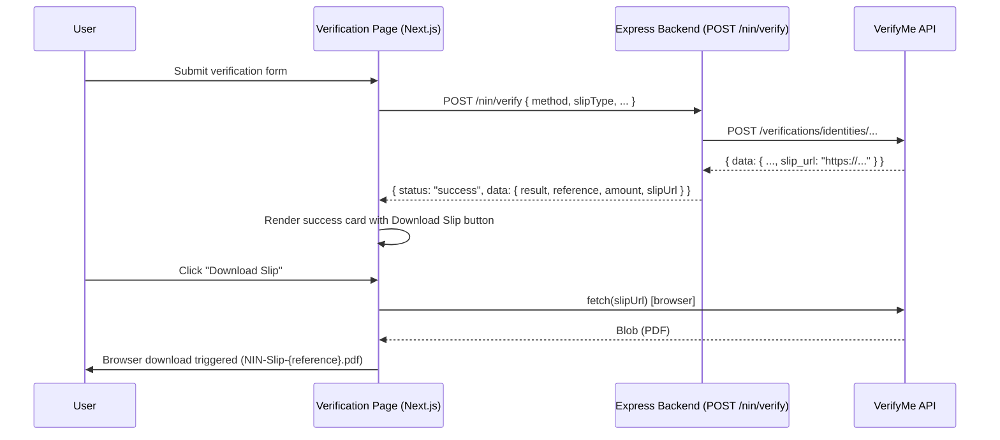

# Design Document: NIN Verification Download Slip

## Overview

This feature adds a "Download Slip" button to the NIN Verification success screen across all four verification pages (by NIN, by Phone, by Bio Data, by VNIN). When a verification succeeds and the backend returns a `slipUrl`, the button allows the user to download the verification slip as a PDF without leaving the page.

The change touches two layers:

1. **Backend** — the `POST /nin/verify` route must extract the `slipUrl` from the VerifyMe API response and include it in the response payload.
2. **Frontend** — the success result card on each of the four verification pages must render the Download Slip button and invoke a shared download utility.

---

## Architecture



---

## Components and Interfaces

### Backend: `nin.router.ts` — `callNimcApi` and `POST /nin/verify`

The `callNimcApi` function currently returns a normalized result object. It must be extended to also return the `slipUrl` extracted from the VerifyMe response.

**Updated `callNimcApi` return type:**

```ts
interface NimcResult {
  fullName:   string;
  firstName:  string;
  lastName:   string;
  middleName: string;
  dob:        string;
  gender:     string;
  phone:      string;
  photo:      string | null;
  nin:        string;
  slipUrl:    string | null;  // NEW
}
```

The `POST /nin/verify` route response shape becomes:

```ts
{
  status: 'success',
  data: {
    result:    NimcResult,
    reference: string,
    amount:    number,
    slipUrl:   string | null,  // NEW — hoisted from result for convenience
  }
}
```

### Frontend: `useDownloadSlip` hook

A new custom hook encapsulates all download logic and state, keeping the page components clean.

```ts
// apps/frontend/hooks/useDownloadSlip.ts

interface UseDownloadSlipOptions {
  slipUrl:   string | null;
  reference: string;
  slipType:  SlipType;
}

interface UseDownloadSlipReturn {
  downloading:   boolean;
  downloadError: string | null;
  handleDownload: () => Promise<void>;
}

export function useDownloadSlip(opts: UseDownloadSlipOptions): UseDownloadSlipReturn
```

### Frontend: `DownloadSlipButton` component

A shared presentational component used by all four verification pages.

```ts
// apps/frontend/components/nin/DownloadSlipButton.tsx

interface DownloadSlipButtonProps {
  slipUrl:   string | null;
  reference: string;
  slipType:  SlipType;
}

export function DownloadSlipButton(props: DownloadSlipButtonProps): JSX.Element
```

Renders:
- Nothing (hidden) when `slipUrl` is `null` — shows "Slip not available for download." message instead
- A primary download button when `slipUrl` is present
- Loading state (disabled + spinner + updated `aria-label`) while downloading
- Inline error message below the button on failure

### Frontend: `downloadSlip` utility

A pure utility function that performs the actual browser download. Keeping it separate from the hook makes it independently testable.

```ts
// apps/frontend/lib/downloadSlip.ts

export async function downloadSlip(
  slipUrl:   string,
  filename:  string
): Promise<void>
```

Internally: fetches the URL as a blob, creates an object URL, programmatically clicks a hidden `<a>` element, then revokes the object URL.

---

## Data Models

### API Response — `POST /nin/verify`

```ts
// Existing fields unchanged; slipUrl added
interface NinVerifyResponse {
  status: 'success';
  data: {
    result: {
      fullName:   string;
      firstName:  string;
      lastName:   string;
      middleName: string;
      dob:        string;
      gender:     string;
      phone:      string;
      photo:      string | null;
      nin:        string;
      slipUrl:    string | null;
    };
    reference: string;
    amount:    number;
    slipUrl:   string | null;
  };
}
```

### Filename Convention

| Slip Type                              | Filename Pattern              |
|----------------------------------------|-------------------------------|
| `basic`, `premium`, `regular`, `standard` | `NIN-Slip-{reference}.pdf`  |
| `vnin`                                 | `VNIN-Slip-{reference}.pdf`   |

The filename is derived purely from `slipType` and `reference` — no server involvement needed.

---

## Correctness Properties

*A property is a characteristic or behavior that should hold true across all valid executions of a system — essentially, a formal statement about what the system should do. Properties serve as the bridge between human-readable specifications and machine-verifiable correctness guarantees.*

### Property 1: Download uses the slipUrl from the result

*For any* valid `slipUrl` string present in the `Verification_Result`, calling `downloadSlip(slipUrl, filename)` SHALL invoke `fetch` with exactly that URL.

**Validates: Requirements 2.2**

---

### Property 2: NIN slip filename matches reference

*For any* reference string and a slip type that is not `vnin`, the filename produced by the download utility SHALL equal `NIN-Slip-{reference}.pdf`.

**Validates: Requirements 3.1**

---

### Property 3: VNIN slip filename matches reference

*For any* reference string when the slip type is `vnin`, the filename produced by the download utility SHALL equal `VNIN-Slip-{reference}.pdf`.

**Validates: Requirements 3.2**

---

### Property 4: Backend response always contains slipUrl field

*For any* valid verification input across all slip types (`basic`, `premium`, `regular`, `standard`, `vnin`), the `POST /nin/verify` response `data` object SHALL contain a `slipUrl` field that is either a non-empty string or `null`.

**Validates: Requirements 5.1, 5.2, 5.3**

---

## Error Handling

| Scenario | Behavior |
|---|---|
| `slipUrl` is `null` in the result | Hide Download button; show "Slip not available for download." |
| `fetch(slipUrl)` returns a non-OK HTTP status | Show inline error "Download failed. Please try again."; re-enable button |
| `fetch(slipUrl)` throws a network error | Same as above |
| VerifyMe API returns no slip URL | Backend sets `slipUrl: null`; frontend hides button |
| Download in progress (user clicks again) | Button is disabled; duplicate requests are prevented |

All errors are surfaced inline below the Download button — no toast or modal — to keep the user on the success screen.

---

## Testing Strategy

### Unit Tests (example-based)

These cover specific scenarios and UI states:

- **`DownloadSlipButton`** renders with `aria-label="Download Slip"` when `slipUrl` is present
- **`DownloadSlipButton`** is hidden and shows "Slip not available for download." when `slipUrl` is `null`
- **`DownloadSlipButton`** shows loading state (disabled, `aria-label="Downloading slip, please wait."`) while download is in progress
- **`DownloadSlipButton`** re-enables after successful download
- **`DownloadSlipButton`** shows inline error "Download failed. Please try again." on fetch failure and re-enables
- **`DownloadSlipButton`** is rendered below result details and above "Verify Another" button in the success card
- **`DownloadSlipButton`** is present on all four verification pages after a successful result
- **Backend** returns `slipUrl: null` when VerifyMe API returns no slip URL (Requirement 5.4)
- **Backend** returns `slipUrl` for `basic` slip type (Requirement 5.2)

### Property-Based Tests

Using **fast-check** (already compatible with the Jest setup in this project).

Each property test runs a minimum of **100 iterations**.

**Property 1 — Download uses the slipUrl from the result**
```
// Feature: nin-verification-download-slip, Property 1: Download uses the slipUrl from the result
fc.assert(fc.asyncProperty(fc.webUrl(), fc.string(), async (slipUrl, filename) => {
  // mock fetch, call downloadSlip(slipUrl, filename)
  // assert fetch was called with slipUrl
}))
```

**Property 2 — NIN slip filename matches reference**
```
// Feature: nin-verification-download-slip, Property 2: NIN slip filename matches reference
fc.assert(fc.property(
  fc.string({ minLength: 1 }),
  fc.constantFrom('basic', 'premium', 'regular', 'standard'),
  (reference, slipType) => {
    const filename = buildFilename(slipType, reference);
    return filename === `NIN-Slip-${reference}.pdf`;
  }
))
```

**Property 3 — VNIN slip filename matches reference**
```
// Feature: nin-verification-download-slip, Property 3: VNIN slip filename matches reference
fc.assert(fc.property(fc.string({ minLength: 1 }), (reference) => {
  const filename = buildFilename('vnin', reference);
  return filename === `VNIN-Slip-${reference}.pdf`;
}))
```

**Property 4 — Backend response always contains slipUrl field**
```
// Feature: nin-verification-download-slip, Property 4: Backend response always contains slipUrl field
fc.assert(fc.asyncProperty(
  fc.constantFrom('basic', 'premium', 'regular', 'standard', 'vnin'),
  fc.record({ nin: fc.string(), ... }),
  async (slipType, input) => {
    // mock VerifyMe API, call POST /nin/verify
    // assert response.data.slipUrl is string | null
  }
))
```

### Integration Tests

- End-to-end: submit a verification form on each of the four pages, confirm the Download Slip button appears in the success card (Playwright or Jest + MSW)
- Backend: `POST /nin/verify` with a mocked VerifyMe response that includes a slip URL — assert `slipUrl` is present in the response
